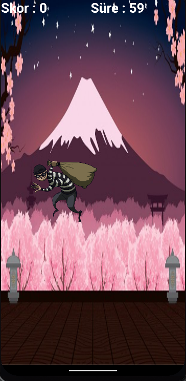
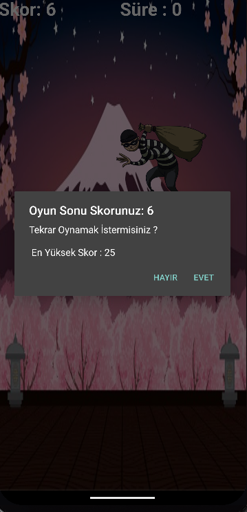

# KOTLIN ALISTIRMA
## Sıkıysa Yakala Beni Oyunu

**Projenin Amacı** 
 - Bu projenin temel amacı, Kotlin programlama dilinde pratik yaparak öğrenmeye yönelik basit bir uygulama geliştirmektir.
  

**Oyunun Amacı** 
 - Oyunun temel amacı, hırsızın farklı noktalarda belirip ortaya çıkmasını beklemek ve onu tıkladıkça skor kazanmaktır. Ancak, burada sadece hırsızı bulmakla kalmayacak, aynı zamanda kendi skorunuzu geçmeye çalışacaksınız.

**Uygulama Resimleri**
 - 
 - 
 - 

